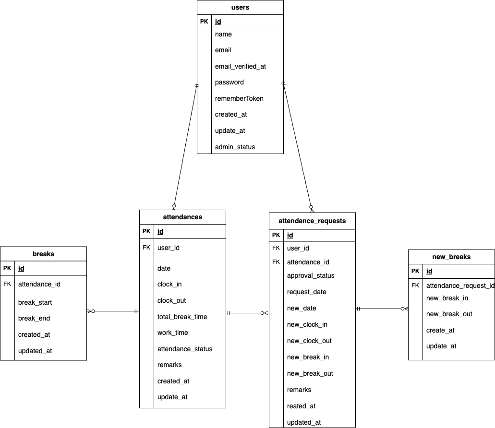

# attendance-management

## 環境構築
**Dockerビルド**
1. `git clone git@github.com:aiko217/attendance-management.git`
2. cd attendance-management
3. DockerDesktopアプリを立ち上げる
4. `docker-compose up -d --build`

**Laravel環境構築**
1. `docker-compose exec php bash`
2. `composer install`
3. 「.env.example」ファイルを 「.env」ファイルに命名を変更。または、新しく.envファイルを作成
4. .envに以下の環境変数を追加
``` text
DB_CONNECTION=mysql
DB_HOST=mysql
DB_PORT=3306
DB_DATABASE=laravel_db
DB_USERNAME=laravel_user
DB_PASSWORD=laravel_pass
```
5. アプリケーションキーの作成
``` bash
php artisan key:generate
```

6. マイグレーションの実行
``` bash
php artisan migrate
```

7. シーディングの実行
``` bash
php artisan db:seed
```

## 使用技術(実行環境)
- PHP8.1.33
- Laravel 8.83.8
- MySQL8.0

- ## URL
- 開発環境：http://localhost/
- phpMyAdmin:：http://localhost:8080/

## ER 図



## テストアカウント
name: 管理者ユーザ  
email: admin@example.com  
password: password123
-------------------------
name: 一般ユーザ  
email: user@gmail.com
password: user1234  
-------------------------

## PHPUnitを利用したテストに関して
以下のコマンド:  
```
//テスト用データベースの作成
docker-compose exec mysql bash
mysql -u root -p
//パスワードはrootと入力
create database demo_test;

docker-compose exec php bash
php artisan migrate:fresh --env=testing
./vendor/bin/phpunit
```
※.env.testingにもStripeのAPIキーを設定してください。 